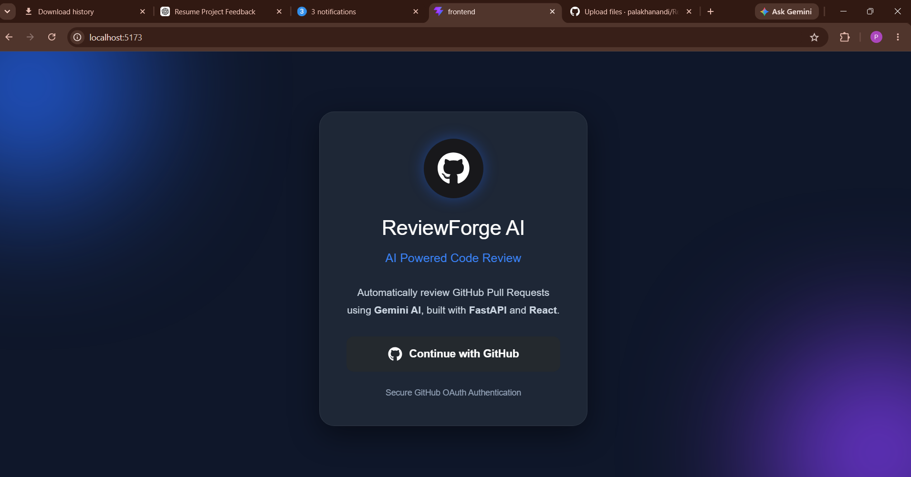
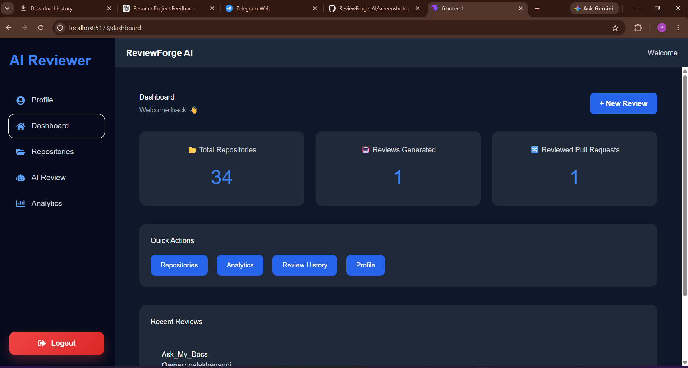
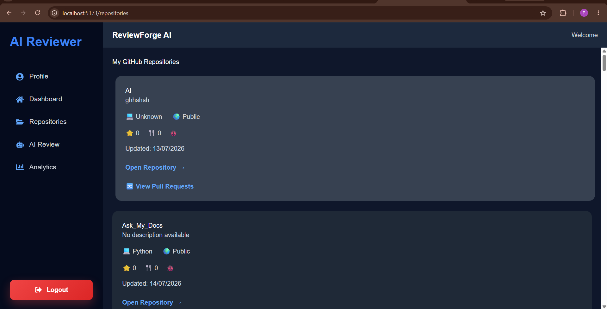
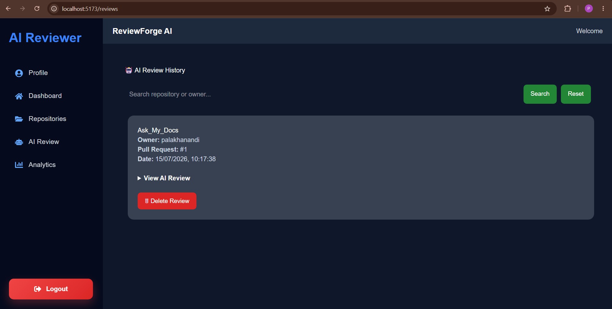
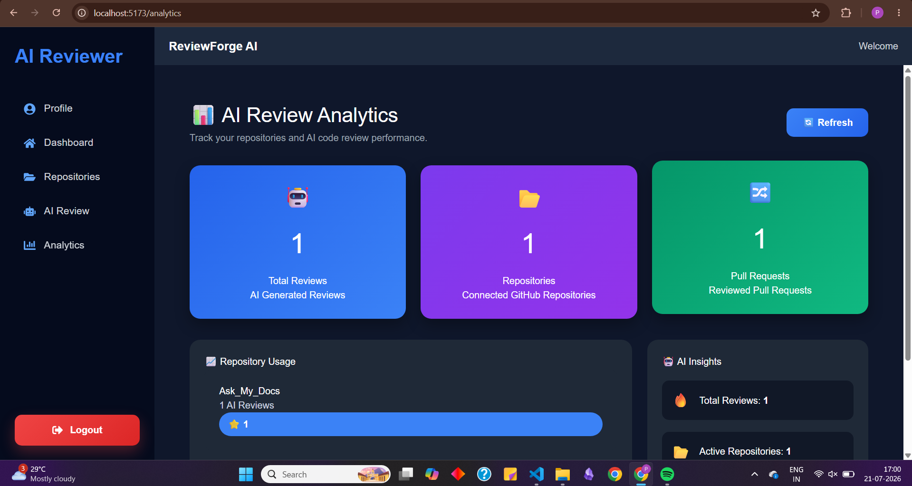
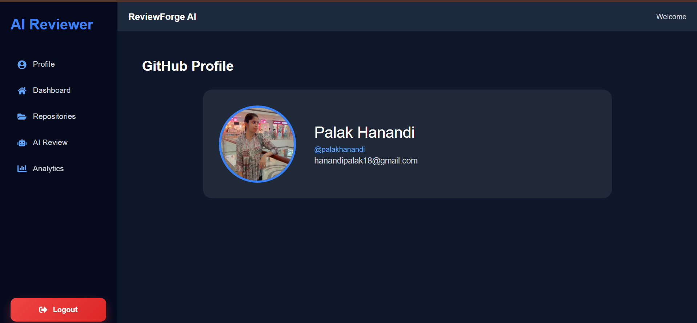

# 🚀 ReviewForge AI

> AI-powered GitHub Pull Request Review Platform built with React, FastAPI, Gemini AI, and GitHub OAuth.

---

## ✨ Features

- 🔐 GitHub OAuth Authentication
- 📂 Browse GitHub Repositories
- 🔀 View Pull Requests
- 🤖 AI-powered Code Reviews using Gemini AI
- 📊 Analytics Dashboard
- 📜 Review History
- 👤 User Profile
- 🌙 Modern Responsive UI

---

## 🛠 Tech Stack

| Frontend | Backend | Database | AI | Deployment |
|-----------|----------|----------|----|------------|
| React + Vite | FastAPI | PostgreSQL | Gemini AI | Render |

---

## 📸 Screenshots

### 🔐 Login



---

### 📊 Dashboard



---

### 📂 Repositories



---

### 🤖 AI Review



---

### 📈 Analytics



---

### 👤 Profile



---

## ⚙️ Installation

```bash
git clone https://github.com/palakhanandi/ReviewForge-AI.git

cd frontend
npm install
npm run dev

cd ../backend
pip install -r requirements.txt
uvicorn app.main:app --reload
```

---

## 🔑 Environment Variables

Backend

```env
DATABASE_URL=
GITHUB_CLIENT_ID=
GITHUB_CLIENT_SECRET=
GITHUB_CALLBACK=
GEMINI_API_KEY=
SECRET_KEY=
```
---

## 🚀 Future Improvements

- AI Review Score
- GitHub Webhooks
- Team Workspace
- PDF Report Export
- Email Notifications

---

## 👩‍💻 Author

**Palak Hanandi**

GitHub: https://github.com/palakhanandi

⭐ If you like this project, consider starring the repository!
